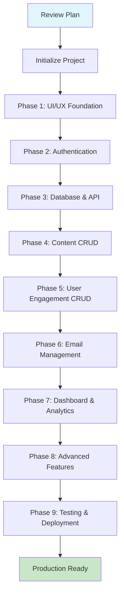

# Admin Panel Implementation Plan

## Overview

This document decomposes the comprehensive admin panel requirements from `Admin-Panel-AI-Prompt.md` into manageable, sequential tasks. Each task is designed to be completed independently, allowing for incremental development, testing, and Git commits. After completing each task, changes will be committed to a feature branch and merged into the main branch for pushing to GitHub.

The implementation follows the specified technical stack: Next.js 14+ with TypeScript, Tailwind CSS, Supabase for authentication and database, and a focus on security, performance, and user experience.

## Implementation Workflow

## Branching Strategy

- **Main Branch:** `main` (or `master` if already exists)
- **Feature Branches:** `feature/<task-slug>` (e.g., `feature/project-setup`, `feature/auth-system`)
- **Workflow:**
  1. Create feature branch from `main`
  2. Implement task
  3. Test locally
  4. Commit changes with descriptive message
  5. Merge feature branch into `main`
  6. Push to GitHub

## Prerequisites

- Node.js 18+
- Git repository initialized
- Supabase project created
- Existing database with 13 tables (as specified in prompt)

## Phases and Tasks

### Phase 1: Project Setup and UI/UX Foundation (Tasks 1-4)

1. **Initialize Next.js Project**
   - Set up Next.js 14+ with TypeScript
   - Configure Tailwind CSS
   - Install dependencies: @supabase/supabase-js, react-hook-form, zustand, uuid, etc.
   - Set up project structure as recommended
   - Configure ESLint and Prettier

2. **Implement Theme System**
   - Implement light/dark mode toggle
   - Configure CSS custom properties for black/white theme
   - Ensure high contrast and no gradients/shadows
   - Create theme context and utilities

3. **Create Basic Admin Layout and Navigation**
   - Build admin layout component with sidebar navigation
   - Implement collapsible sidebar with main sections
   - Create top bar with user info and logout placeholder
   - Set up routing structure for admin pages

4. **Set up Responsive Design Framework**
   - Implement mobile-first responsive design
   - Optimize layouts for tablet (768px-1024px) and desktop (1024px+)
   - Ensure touch-friendly interactive elements
   - Test cross-platform compatibility

### Phase 2: Authentication System (Tasks 5-11)

5. **Supabase Project Configuration**
   - Create/configure Supabase project
   - Set up environment variables (.env.local)
   - Configure Supabase Storage bucket "public"
   - Enable necessary Supabase features (Auth, Storage, Realtime)

6. **Database Schema Setup**
   - Create admin_users table
   - Create admin_sessions table
   - Create admin_audit_log table
   - Enable RLS on all tables (existing + new)
   - Set up initial RLS policies

7. **Supabase Authentication System**
   - Implement Supabase Auth client setup
   - Create authentication utilities
   - Set up JWT token handling
   - Implement session management

8. **Login and Authentication UI**
   - Create login page (/admin/login)
   - Implement authentication forms with theme compliance
   - Add authentication middleware for protected routes
   - Create logout functionality

9. **Password Reset Functionality**
   - Implement password reset flow using Supabase Auth
   - Create reset password UI
   - Add email templates for password reset
   - Handle password strength validation

10. **Role-Based Access Control**
    - Implement RBAC system (admin, super_admin, editor)
    - Create authorization utilities
    - Set up route protection based on roles
    - Update RLS policies for role-based access

11. **Authentication API Routes**
    - Create /api/auth/login
    - Create /api/auth/logout
    - Create /api/auth/session
    - Implement proper error handling and validation

### Phase 3: Database and API Infrastructure (Tasks 12-15)

12. **Database Connection and Utilities**
    - Create Supabase client configuration
    - Implement database query utilities
    - Set up connection pooling and error handling
    - Create type definitions for all tables

13. **Row Level Security Policies**
    - Implement comprehensive RLS policies for all tables
    - Test policies with different user roles
    - Ensure admin-only access to sensitive data

14. **Reusable Components Setup**
    - Create reusable UI components (buttons, forms, tables)
    - Implement data table component with sorting/filtering
    - Build modal and form components
    - Set up component library structure

15. **API Infrastructure**
    - Create base API utilities and error handling
    - Implement useApiRequest hook for request management
    - Set up API response caching and deduplication
    - Create API route templates

### Phase 4: Core CRUD Operations - Content Management (Tasks 16-22)

16. **Courses CRUD Implementation**
    - Create /api/courses API routes (GET, POST, PUT, DELETE)
    - Build courses list page with data table
    - Create course creation/editing forms
    - Implement category assignment and image upload

17. **Services CRUD Implementation**
    - Create /api/services API routes
    - Build services management pages
    - Implement service forms with image upload
    - Add service categorization

18. **Offers CRUD Implementation**
    - Create /api/offers API routes
    - Build offers management interface
    - Implement validity period management
    - Add discount calculation logic

19. **Categories CRUD Implementation**
    - Create /api/categories API routes for both course and service categories
    - Build unified category management
    - Implement category hierarchy and sorting
    - Add category slug generation

20. **FAQs CRUD Implementation**
    - Create /api/faqs API routes
    - Build FAQ management interface
    - Implement search and categorization
    - Add bulk operations

21. **Business Info CRUD Implementation**
    - Create /api/business-info API routes
    - Build business information management
    - Implement contact details and hours management
    - Add social media links handling

22. **Site Settings CRUD Implementation**
    - Create /api/site-settings API routes
    - Build settings management interface
    - Implement key-value pair editing
    - Add environment-specific settings

### Phase 5: Core CRUD Operations - User Engagement (Tasks 23-26)

23. **Contact Submissions CRUD Implementation**
    - Create /api/contacts API routes
    - Build contact submissions management
    - Implement read/unread status tracking
    - Add response tracking and export functionality

24. **Newsletter Subscriptions CRUD Implementation**
    - Create /api/newsletter API routes
    - Build subscriber management interface
    - Implement subscription status management
    - Add bulk operations and segmentation

25. **Reviews CRUD Implementation**
    - Create /api/reviews API routes
    - Build review management with approval workflow
    - Implement star rating management
    - Add response functionality

26. **Testimonials CRUD Implementation**
    - Create /api/testimonials API routes
    - Build testimonial management
    - Implement approval and featured selection
    - Add rating analytics

### Phase 6: Email Management and Export Features (Tasks 27-30)

27. **Email Export Functionality**
    - Implement CSV/Excel export for subscribers
    - Add export for contact submissions
    - Create export utilities with filtering
    - Implement scheduled export reports

28. **Newsletter Management System**
    - Build newsletter subscriber interface
    - Implement bulk email operations
    - Add subscriber segmentation
    - Create import/export capabilities

29. **Email Template System**
    - Create email template management
    - Implement template customization
    - Add automated email triggers
    - Integrate with SMTP settings

30. **Email Campaign Features**
    - Build campaign creation interface
    - Implement campaign performance tracking
    - Add subscriber segmentation for campaigns
    - Create campaign analytics

### Phase 7: Dashboard and Analytics (Tasks 31-33)

31. **Overview Dashboard Creation**
    - Build main dashboard with statistics widgets
    - Implement recent activity feeds
    - Add revenue and booking trends
    - Create quick action buttons

32. **Analytics and Reporting Implementation**
    - Implement user engagement metrics
    - Add content performance analytics
    - Create custom date range reporting
    - Build export functionality for analytics

33. **Statistics Tracking System**
    - Integrate with statistics table
    - Implement real-time statistics updates
    - Add performance metrics tracking
    - Create statistics visualization

### Phase 8: Advanced Features (Tasks 34-38)

34. **File Upload System Setup**
    - Configure Supabase Storage
    - Implement secure file upload API
    - Add file validation and size limits
    - Set up folder organization

35. **Reusable ImageUpload Component**
    - Create ImageUpload component with drag & drop
    - Implement real-time preview
    - Add progress indicators and error handling
    - Integrate with form validation

36. **Search and Filtering Implementation**
    - Implement global search across content types
    - Add advanced filtering capabilities
    - Create search result highlighting
    - Optimize search performance

37. **Bulk Operations System**
    - Implement bulk status changes
    - Add bulk category assignments
    - Create bulk import/export functionality
    - Add progress tracking for bulk operations

38. **Audit Logging System**
    - Implement comprehensive audit logging
    - Track all admin actions
    - Create audit log viewer
    - Add audit log export

### Phase 9: UI/UX Polish and Optimization (Tasks 39-44)

39. **Loading States and Error Handling**
    - Implement useApiRequest hook for request management
    - Add loading indicators throughout UI
    - Create error boundaries and fallback UI
    - Implement graceful error messages

40. **Keyboard Shortcuts and Accessibility**
    - Add keyboard shortcuts for power users
    - Implement proper ARIA labels
    - Ensure WCAG compliance
    - Add focus management

41. **Help Documentation Integration**
    - Create in-app help system
    - Add tooltips and contextual help
    - Implement user onboarding
    - Create help documentation pages

42. **Performance Optimization**
    - Implement caching strategies
    - Optimize bundle size
    - Add lazy loading for components
    - Monitor and improve Core Web Vitals

43. **Theme System Refinement**
    - Finalize light/dark mode implementation
    - Ensure consistent theme application
    - Test theme persistence and switching

44. **Responsive Design Finalization**
    - Complete mobile and tablet optimizations
    - Ensure consistent experience across devices
    - Final cross-browser testing

### Phase 10: Testing and Deployment (Tasks 45-48)

45. **Unit Testing Implementation**
    - Write unit tests for utilities and components
    - Set up testing framework (Jest + React Testing Library)
    - Implement test coverage requirements
    - Add CI/CD testing pipeline

46. **Integration Testing**
    - Test API integrations
    - Validate authentication flows
    - Test CRUD operations end-to-end
    - Perform cross-browser testing

47. **Security Testing and Validation**
    - Conduct security audit
    - Test RLS policies thoroughly
    - Validate input sanitization
    - Perform penetration testing

48. **Production Deployment**
    - Set up production environment
    - Configure production Supabase settings
    - Implement backup and restore procedures
    - Deploy to hosting platform
    - Set up monitoring and alerting

## Success Criteria Verification

After completing all tasks, verify:
- Secure authentication with email/password and password reset
- Complete CRUD operations for all database tables
- Efficient email management with export capabilities
- Intuitive UI following design requirements
- Comprehensive search, filtering, and bulk operations
- Proper security measures and error handling
- Mobile-responsive design
- Performance optimization for large datasets

## Risk Mitigation

- Regular commits and backups
- Thorough testing at each phase
- Security reviews before deployment
- Performance monitoring throughout development

## Timeline Estimate

- Phase 1: 1-2 weeks (UI/UX Foundation)
- Phase 2: 2-3 weeks (Authentication System)
- Phase 3: 1-2 weeks (Database & API Infrastructure)
- Phase 4-5: 3-4 weeks (Core CRUD Operations)
- Phase 6: 2-3 weeks (Email Management)
- Phase 7: 1-2 weeks (Dashboard & Analytics)
- Phase 8: 2-3 weeks (Advanced Features)
- Phase 9: 1-2 weeks (UI/UX Polish)
- Phase 10: 1-2 weeks (Testing & Deployment)

Total: 10-15 weeks for complete implementation

## Next Steps

1. Review and approve this plan
2. Initialize Git repository if not already done
3. Start with Task 1: Initialize Next.js Project
4. Create feature branch and begin implementation